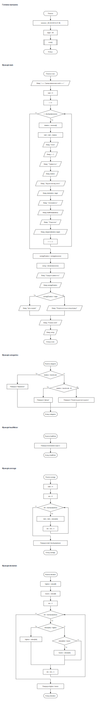

# Piton

**Piton** - інтерпретована мова програмування з українським синтаксисом у трансліті. Вона написана на Go і орієнтована на навчання, швидкі експерименти та демонстрацію того, як влаштовані інтерпретатори.

Коротко про мову:

- змінні оголошуються простим `=`
- блоки керуються відступами
- умови пишуться через `yaksho` / `inackshe`
- цикл у мові зараз один: `poky`
- функції створюються через `functia`
- колекції: `spysok` (`[]`) і `slovnyk` (`{}`)
- є вбудовані функції на кшталт `dovzhyna()`, `dodaty()`, `delete()`, `vypadkovo()`
- через CLI можна не лише запускати код, а й будувати SVG-блок-схеми

Бінарники можна або зібрати локально з вихідного коду, або просто скачати з [Releases](https://github.com/OlexiyOdarchuk/piton/releases) для актуальних платформ `Linux`, `macOS` і `Windows`.

## Minimalnyi pryklad

```piton
profil = {"imya": "Mavka", "mista": ["Lviv", "Kyiv"]}
profil["rol"] = "moderator"
delete(profil, "rol")

drukuvaty profil["imya"]
drukuvaty profil
```

## Shcho chytaty dалі

Якщо ти тільки починаєш:

1. [Shvydkyi Start](./quick-start.md)
2. [Tur po Movi](./tour.md)
3. [Bazovyi Syntaksys](./syntax.md)
4. [Spysok](./spysok.md) і [Slovnyk](./slovnyk.md)
5. [Vbudovani Funktsii](./builtins.md)

Якщо тобі потрібен інструментальний бік проєкту:

- [Vstanovlennya ta CLI](./install-and-cli.md)
- [Vizualizator](./visualizer.md)
- [Piton z Go](./embedding-go.md)

## Yak vyhlyadaye kod u vizualizatori

Нижче - реальна SVG-схема, згенерована з `examples/session-tracker.piton`.


