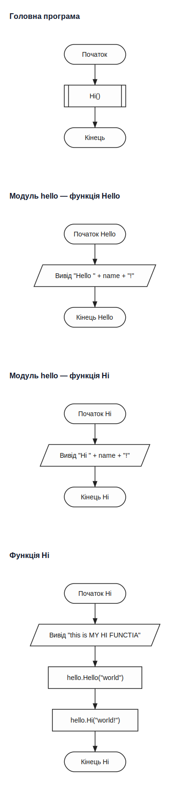
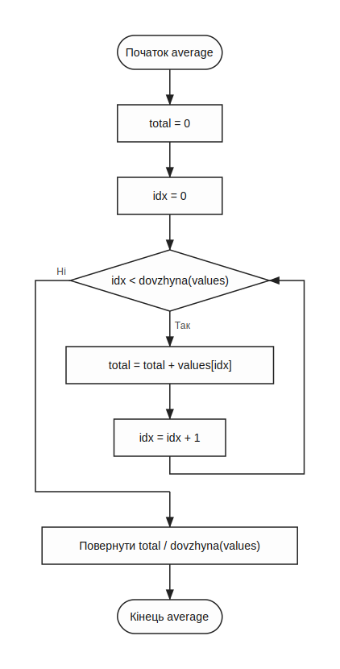
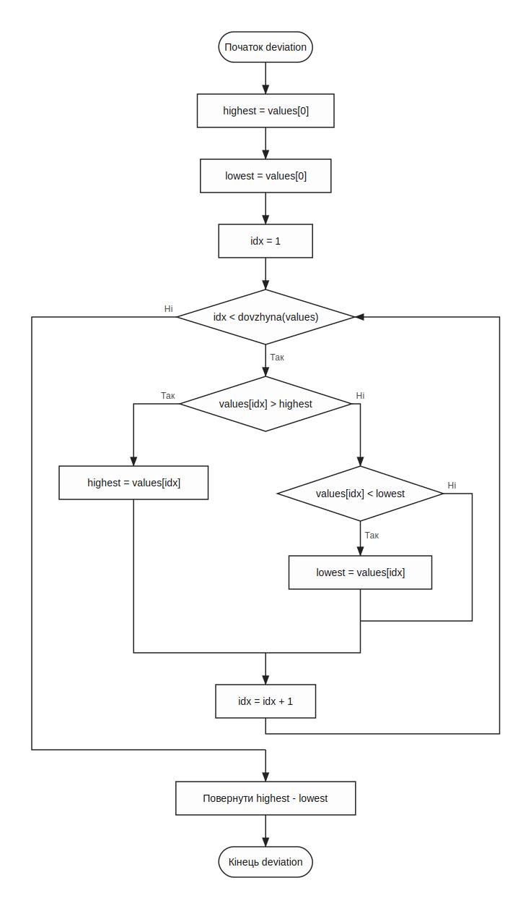

# Vizualizator

Piton уміє не тільки виконувати код, а й будувати SVG-блок-схеми.

## Komandy

```bash
./piton -draw ./main.piton
./piton -all ./main.piton
./piton -draw -split ./main.piton
./piton -draw -target=myFunc ./main.piton
```

## Shcho robyt

- збирає AST програми
- може підтягувати імпортовані модулі
- будує окремі схеми для функцій або загальну схему програми

Це корисно для навчання, рев’ю логіки та демонстрації алгоритмів.

## Pryklad: povna skhema prohramy

Нижче - згенерована схема для `examples/session-tracker.piton`.


## Pryklad: skhema proyektu z importamy

Нижче - згенерована схема для `examples/vykorystaty-demo.piton`, побудована через `-all`, тобто разом з імпортованим модулем.



## Pryklad: okrema funktsiya u split-rezhymi

`-split` корисний, коли повна схема завелика. Ось окрема функція `average` із `session-tracker`:



І ще одна окрема функція `deviation`:



## Koly shcho vykorystovuvaty

- `-draw` - коли працюєш з одним файлом
- `-all` - коли хочеш бачити програму разом з імпортами
- `-split` - коли функцій багато і потрібні окремі діаграми
- `-target=name` - коли треба проаналізувати тільки одну функцію

SVG, які бачиш у цій книжці, згенеровані реальним `piton` з прикладів репозиторію, а не намальовані вручну.
